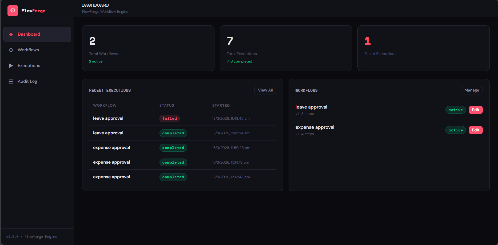
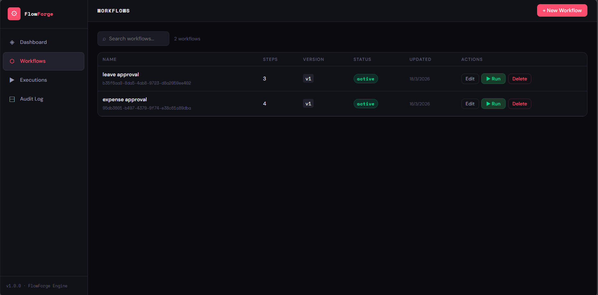
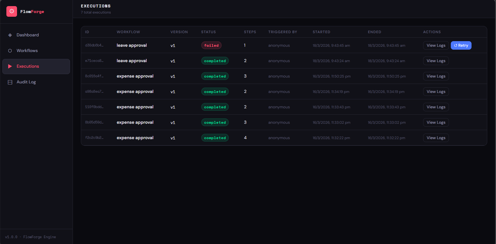
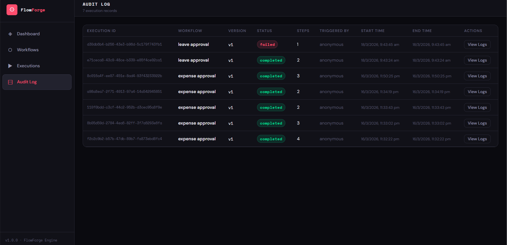

# FlowForge — Workflow Engine

A full-stack workflow automation engine that lets users design workflows,
define rules, execute processes, and track every step.
---
## Tech Stack
Layer and Technology 
 Backend : Python, Django 4.2, Django REST Framework 
 Database : MySQL 
 Rule Engine : Custom Python DSL evaluator 
 Frontend : React 18, Vite
 API : RESTful JSON API 
---

## Features

- ✅ Create and manage workflows with versioning
- ✅ Define steps (Task, Approval, Notification)
- ✅ Rule engine with dynamic conditions
- ✅ Execute workflows with input data
- ✅ Real-time execution logs and step tracking
- ✅ Audit log for compliance
- ✅ Retry failed executions
- ✅ Cancel in-progress executions
- ✅ Infinite loop protection (max 50 iterations)

---

## Rule Engine Operators
```
Comparison : ==, !=, <, >, <=, >=
Logical    : && (AND), || (OR)
String     : contains(field, "value")
             startsWith(field, "prefix")
             endsWith(field, "suffix")
Special    : DEFAULT (catch-all rule)
```
---

## Project Structure
```
flowforge/
├── config/                  # Django project settings
│   ├── settings.py
│   ├── urls.py
│   ├── wsgi.py
│   └── asgi.py
│
├── workflows/               # Workflows, Steps, Rules
│   ├── models.py            # Workflow, Step, Rule models
│   ├── serializers.py       # DRF serializers
│   ├── views.py             # API viewsets
│   ├── urls.py              # URL routing
│   ├── rule_engine.py       # Rule condition evaluator
│   └── admin.py
│
├── executions/              # Execution engine
│   ├── models.py            # Execution model
│   ├── engine.py            # WorkflowEngine class
│   ├── serializers.py
│   ├── views.py
│   └── urls.py
│
├── frontend/                # React Vite frontend
│   ├── src/
│   │   ├── components/
│   │   │   ├── Dashboard.jsx
│   │   │   ├── WorkflowList.jsx
│   │   │   ├── WorkflowEditor.jsx
│   │   │   ├── ExecutionList.jsx
│   │   │   ├── ExecutionDetail.jsx
│   │   │   ├── AuditLog.jsx
│   │   │   ├── Layout.jsx
│   │   │   ├── Badge.jsx
│   │   │   └── Btn.jsx
│   │   ├── services/
│   │   │   └── api.js       # Axios API client
│   │   ├── App.jsx
│   │   ├── main.jsx
│   │   └── index.css
│   ├── package.json
│   └── vite.config.js
│
├── manage.py
├── requirements.txt
├── .env                     # Environment variables (not committed)
└── .gitignore
```

---

## Setup Instructions

### Prerequisites

- Python 3.10+
- Node.js 18+
- MySQL 8.0+

---
### 1. Clone the Repository
```bash
git clone https://github.com/Swetha-R23/flowforge.git
cd flowforge
```
---
### 2. Create MySQL Database
```sql
CREATE DATABASE flowforge_db CHARACTER SET utf8mb4 COLLATE utf8mb4_unicode_ci;
```
---
### 3. Backend Setup
```bash
# Create virtual environment
python -m venv venv

# Activate virtual environment
# Windows:
venv\Scripts\activate
# Mac/Linux:
source venv/bin/activate

# Install dependencies
pip install -r requirements.txt
```

Create `.env` file in the root directory:
```env
SECRET_KEY=your-secret-key-change-in-production
DEBUG=True
ALLOWED_HOSTS=localhost,127.0.0.1

DB_NAME=flowforge_db
DB_USER=root
DB_PASSWORD=your_mysql_password
DB_HOST=127.0.0.1
DB_PORT=3306

CORS_ALLOW_ALL_ORIGINS=True
CORS_ALLOWED_ORIGINS=http://localhost:5173,http://127.0.0.1:5173
```

Run migrations and create superuser:
```bash
python manage.py makemigrations workflows executions
python manage.py migrate
python manage.py createsuperuser
python manage.py runserver
```

Backend runs at: `http://127.0.0.1:8000`

---

### 4. Frontend Setup
```bash
cd frontend
npm install
npm run dev
```

Frontend runs at: `http://localhost:5173`
---

### 5. Access the Application

URL - Description 

http://localhost:5173 - Main application 
http://127.0.0.1:8000/api/ - REST API browser 
http://127.0.0.1:8000/api/docs/ - Swagger API docs 
http://127.0.0.1:8000/admin/ - Django admin 

---

## API Endpoints

### Workflows

Method | Endpoint | Description 

GET    | /api/workflows/             | List all workflows 
POST   | /api/workflows/             | Create workflow 
GET    | /api/workflows/:id/         | Get workflow details 
PUT    | /api/workflows/:id/         | Update workflow 
DELETE | /api/workflows/:id/         | Delete workflow 
POST   | /api/workflows/:id/execute/ | Execute workflow 

### Steps

Method | Endpoint | Description 

GET    | /api/workflows/:id/steps/ | List steps 
POST   | /api/workflows/:id/steps/ | Add step 
PUT    | /api/steps/:id/           | Update step 
DELETE | /api/steps/:id/           | Delete step 

### Rules

Method | Endpoint | Description 

GET    | /api/steps/:id/rules/ | List rules 
POST   | /api/steps/:id/rules/ | Add rule 
PUT    | /api/rules/:id/       | Update rule 
DELETE | /api/rules/:id/       | Delete rule 

### Executions

Method | Endpoint | Description 

 GET  | /api/executions/            | List executions 
 GET  | /api/executions/:id/        | Get execution logs 
 POST | /api/executions/:id/cancel/ | Cancel execution 
 POST | /api/executions/:id/retry/  | Retry failed step 

---

## Sample Workflow — Expense Approval

### Input Schema
```json
{
  "amount":     { "type": "number", "required": true },
  "country":    { "type": "string", "required": true },
  "priority":   { "type": "string", "required": true,
                  "allowed_values": ["High", "Medium", "Low"] },
  "department": { "type": "string", "required": false }
}
```

### Steps and Rules
```
Step 1: Manager Approval (approval)
  Rule 1 → amount > 100 && country == 'US' && priority == 'High'  → Finance Notification
  Rule 2 → amount <= 100                                           → Task Completion
  Rule 3 → DEFAULT                                                 → Task Completion

Step 2: Finance Notification (notification)
  Rule 1 → amount > 500   → CEO Approval
  Rule 2 → DEFAULT        → Task Completion

Step 3: CEO Approval (approval)
  Rule 1 → DEFAULT        → Task Completion

Step 4: Task Completion (task)
  ← No rules needed — ends workflow automatically
```

### Test Execution
```json
POST /api/workflows/{id}/execute/
{
  "data": {
    "amount": 750,
    "country": "US",
    "priority": "High",
    "department": "Finance"
  }
}
```

Expected result:
```
Manager Approval → Finance Notification → CEO Approval → Task Completion
Status: completed · Steps: 4
```

---

## How the Rule Engine Works

1. Workflow execution starts at the first step
2. For each step, rules are evaluated in priority order (1 = first)
3. The first matching rule determines the next step
4. If `next_step` is `null` → workflow ends
5. If a step has no rules → workflow ends automatically
6. `DEFAULT` always evaluates to `true` — use as catch-all
7. Maximum 50 iterations to prevent infinite loops

### Rule Condition Examples
```
amount > 100
country == 'US'
amount > 100 && country == 'US'
priority == 'High' || priority == 'Medium'
amount >= 500 && priority != 'Low'
contains(department, 'Finance')
startsWith(country, 'U')
DEFAULT
```

---

## Data Models

### Workflow
```
id            UUID
name          string
version       integer (auto-increments on update)
is_active     boolean
input_schema  JSON
start_step    FK → Step
created_at    datetime
updated_at    datetime
```

### Step
```
id          UUID
workflow    FK → Workflow
name        string
step_type   enum (task, approval, notification)
order       integer
metadata    JSON
created_at  datetime
updated_at  datetime
```

### Rule
```
id           UUID
step         FK → Step
condition    string
next_step    FK → Step (nullable)
priority     integer
created_at   datetime
updated_at   datetime
```

### Execution
```
id                UUID
workflow          FK → Workflow
workflow_version  integer
status            enum (pending, in_progress, completed, failed, canceled)
data              JSON (input values)
logs              JSON (step execution logs)
current_step_id   UUID
retries           integer
triggered_by      string
started_at        datetime
ended_at          datetime
```

---

## Running Tests
```bash
# Run all tests
python manage.py test workflows executions

# Run specific app tests
python manage.py test workflows
python manage.py test executions
```




